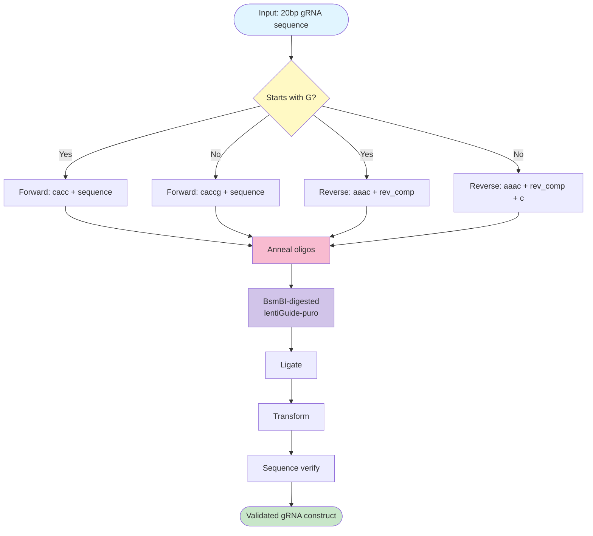
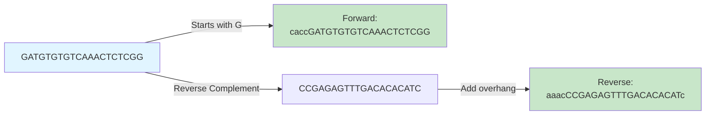
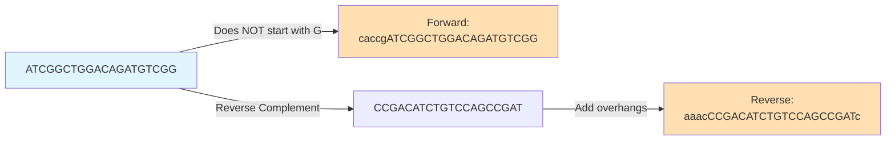
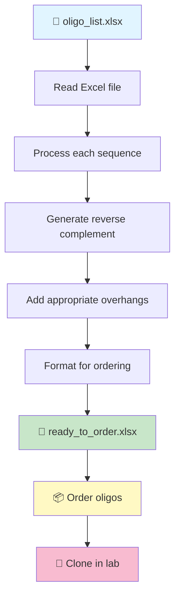

```mermaid
flowchart TB
    Start([Input: 20bp gRNA sequence]) --> Check{Starts with G?}
    
    Check -->|Yes| ForwardG[Forward: cacc + sequence]
    Check -->|No| ForwardNG[Forward: caccg + sequence]
    
    Check -->|Yes| ReverseG[Reverse: aaac + rev_comp]
    Check -->|No| ReverseNG[Reverse: aaac + rev_comp + c]
    
    ForwardG --> Anneal[Anneal oligos]
    ForwardNG --> Anneal
    ReverseG --> Anneal
    ReverseNG --> Anneal
    
    Anneal --> Vector[BsmBI-digested<br/>lentiGuide-puro]
    Vector --> Ligate[Ligate]
    Ligate --> Transform[Transform]
    Transform --> Verify[Sequence verify]
    Verify --> Done([Validated gRNA construct])
    
    style Start fill:#e1f5ff
    style Done fill:#c8e6c9
    style Check fill:#fff9c4
    style Anneal fill:#f8bbd0
    style Vector fill:#d1c4e9
```

## Example: Sequence Processing

### Input Sequence: GATGTGTGTCAAACTCTCGG

```mermaid
flowchart LR
    A[GATGTGTGTCAAACTCTCGG] -->|Starts with G| B[Forward:<br/>caccGATGTGTGTCAAACTCTCGG]
    A -->|Reverse Complement| C[CCGAGAGTTTGACACACATC]
    C -->|Add overhang| D[Reverse:<br/>aaacCCGAGAGTTTGACACACATc]
    
    style A fill:#e1f5ff
    style B fill:#c8e6c9
    style D fill:#c8e6c9
```

### Input Sequence: ATCGGCTGGACAGATGTCGG

```mermaid
flowchart LR
    A[ATCGGCTGGACAGATGTCGG] -->|Does NOT start with G| B[Forward:<br/>caccgATCGGCTGGACAGATGTCGG]
    A -->|Reverse Complement| C[CCGACATCTGTCCAGCCGAT]
    C -->|Add overhangs| D[Reverse:<br/>aaacCCGACATCTGTCCAGCCGATc]
    
    style A fill:#e1f5ff
    style B fill:#ffe0b2
    style D fill:#ffe0b2
```

## Tool Workflow

```mermaid
flowchart TD
    Input[📁 oligo_list.xlsx] --> Read[Read Excel file]
    Read --> Process[Process each sequence]
    
    Process --> RevComp[Generate reverse complement]
    RevComp --> AddOver[Add appropriate overhangs]
    
    AddOver --> Format[Format for ordering]
    Format --> Output[📁 ready_to_order.xlsx]
    
    Output --> Order[📦 Order oligos]
    Order --> Lab[🧬 Clone in lab]
    
    style Input fill:#e1f5ff
    style Output fill:#c8e6c9
    style Order fill:#fff9c4
    style Lab fill:#f8bbd0
```
